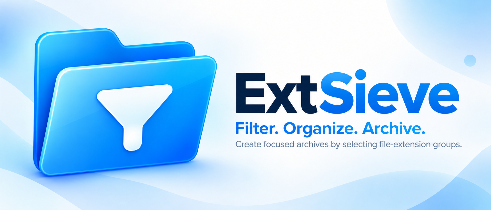
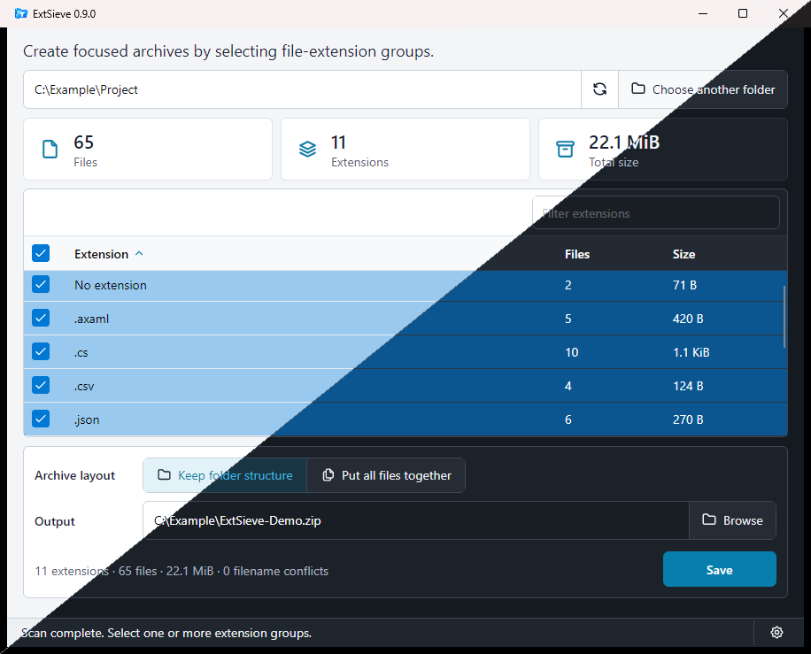

<p align="center">
  
</p>

# ExtSieve

**Filter. Organize. Archive.**

ExtSieve is a lightweight desktop utility for building focused ZIP archives from
selected file extensions. Choose a folder, scan it, select the extension groups you
want, and save a clean archive without modifying the source.

[](#packaging)
[](#packaging)
[](#supported-languages)
[](LICENSE)
[](#build-from-source)

## Screenshot



Main view — Light and Dark themes

## Features

- Scan folders recursively and group files by extension.
- Filter, sort, and select extension groups, including all groups at once with the
  global selector.
- Keep the original folder structure or place selected files together.
- Handle flat-layout filename conflicts safely and deterministically.
- Create ZIP archives without modifying source files.

## Supported languages

- English
- Italiano
- Deutsch
- Français
- Español
- Português (Brasil)

Some non-English translations were prepared with AI assistance and may be refined
over time.

## Basic usage

1. Choose a source folder to scan.
2. Filter, sort, and select the extension groups to include.
3. Choose whether to keep the original folder structure or place all selected files
   together.
4. Choose the output ZIP destination.
5. Select **Save**.

## Build from source

Requirements:

- .NET 10 SDK

Run from this directory:

```shell
dotnet restore ExtSieve.sln --locked-mode
dotnet build ExtSieve.sln --no-restore
dotnet test ExtSieve.sln --no-build --no-restore
dotnet run --project src/ExtSieve.App/ExtSieve.App.csproj
```

## Packaging

The release artifact set is designed for normal installation and portable use:

- Windows x64: installer (`.exe`) or portable archive (`.zip`).
- Linux x64: Debian package (`.deb`), RPM package (`.rpm`), or portable archive
  (`.tar.gz`) for compatible glibc-based distributions.

The current Windows installer is not digitally signed. Windows may display an
"Unknown publisher" or Microsoft Defender SmartScreen warning. SHA-256 checksums are
provided to verify downloaded file integrity; they do not provide the publisher
identity assurance of Authenticode signing.

<details>
<summary>Package commands and output details</summary>

Create the Windows x64 portable package and installer (Inno Setup 7.1.0 required):

```powershell
powershell -NoProfile -ExecutionPolicy Bypass -File scripts/publish-windows.ps1
```

Create the glibc Linux x64 portable, DEB, and RPM packages (nFPM 2.47.0 required):

```bash
./scripts/publish-linux.sh
```

Both scripts restore locked dependencies, build and test Release, then write versioned
artifacts, sorted SHA-256 file manifests, and per-artifact checksum sidecars under the
Git-ignored `artifacts/` directory. See
[`LINUX_REQUIREMENTS.md`](LINUX_REQUIREMENTS.md) for Linux native libraries and
optional desktop integration.

The packages are multi-file, untrimmed, and not Native AOT. Direct dependencies are
centrally pinned in `Directory.Packages.props`, with resolved dependency graphs in the
per-project lock files.

</details>

## Security and privacy

The core ExtSieve archive workflow runs locally and does not require an account,
network access, telemetry, analytics, or credentials. Archive creation reads but does
not modify source files. Report security issues using the guidance in
[`SECURITY.md`](SECURITY.md).

## Support

I'm working toward making software development my full-time job.

If you'd like to support my work, you can do so on Ko-fi.

<p>
  <a href="https://ko-fi.com/melnorme">
    
  </a>
</p>

## Contributing

ExtSieve is not currently accepting external contributions. See
[`CONTRIBUTING.md`](CONTRIBUTING.md) for the current policy.

## License and third-party notices

ExtSieve is released under the [MIT License](LICENSE). The copyright and license notice
must be preserved as required by the license. Additional attribution is appreciated,
but not required. Licenses and notices for shipped third-party components are listed
separately in [`THIRD_PARTY_NOTICES.md`](THIRD_PARTY_NOTICES.md).
